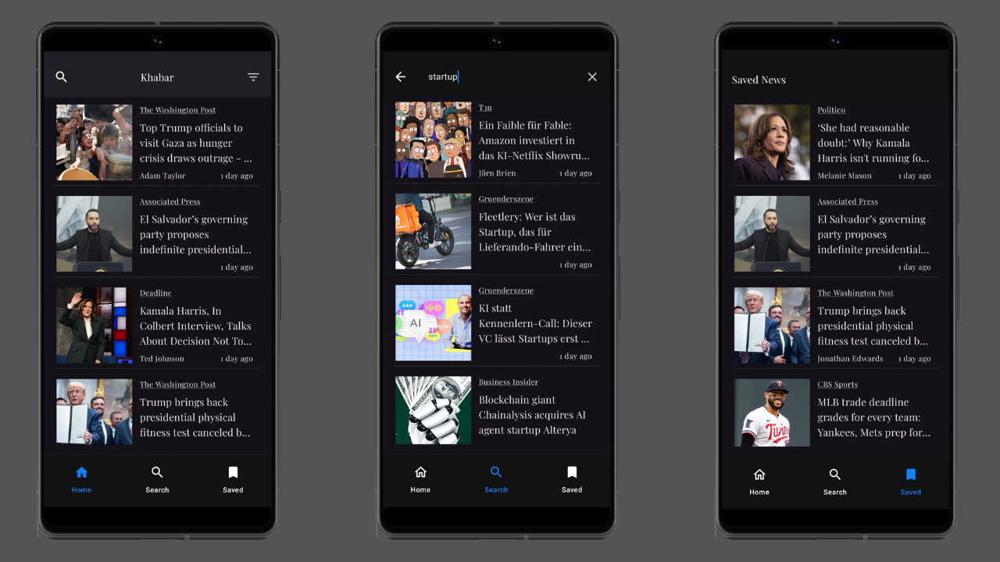

# Khabar – Jetpack Compose News App

#### Khabar is a news reader app for Android, designed using the latest Jetpack Compose and Material 3 libraries. The UI automatically supports dark and light mode, follows the MVVM (Model-View-ViewModel) architecture, and is ready for real-world extensibility with dependency injection, navigation, and clean domain separation.

## Screenshots



## Features
* **Beautiful Light & Dark UI**: Adapts instantly to device theme with thoughtfully selected color palettes for readability and accessibility.
* **MVVM Pattern**: Clean separation of UI, logic, and data for maintainable and testable code.
* **Jetpack Compose**: 100% declarative UI, state-driven rendering, and efficient recomposition.
* **Navigation Compose**: Simple and robust screen navigation with argument passing.
* **Hilt for DI**: Dependency injection ready out of the box.

## Tech Stack

- **Jetpack Compose** – Declarative UI framework
- **Paging 3** – Efficient data pagination
- **Room** – Local database caching
- **Retrofit** – API client for network requests
- **Deep Linking** – For direct navigation
- **Kotlin Coroutines + Flow** – For async and reactive programming
- **Material 3** – UI design

## Installation & Setup

1. **Clone the Repository**
   ```bash
   git clone https://github.com/knomaeb/Khabar.git
   cd Khabar
   ```

2. **Get Your API Credentials**
    - Sign up at [https://www.newsapi.org](https://www.newsapi.org) and get:
        - **API Key**

3. **Add Credentials to `local.properties`**
   ```properties
   API_KEY=your_news_api_key
   ```

4. **Open the project in Android Studio**

5. **Sync Gradle and build the project**

6. **Run the app** on an emulator or a physical device

## License

```
Copyright 2022 The Android Open Source Project

Licensed under the Apache License, Version 2.0 (the "License");
you may not use this file except in compliance with the License.
You may obtain a copy of the License at

    https://www.apache.org/licenses/LICENSE-2.0

Unless required by applicable law or agreed to in writing, software
distributed under the License is distributed on an "AS IS" BASIS,
WITHOUT WARRANTIES OR CONDITIONS OF ANY KIND, either express or implied.
See the License for the specific language governing permissions and
limitations under the License.
```
